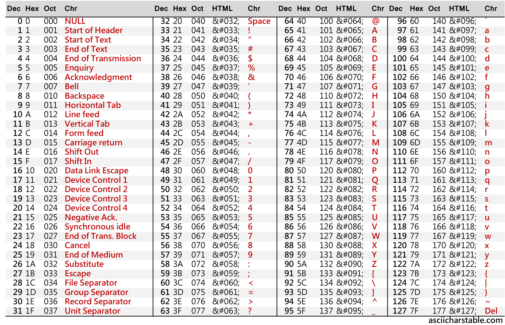
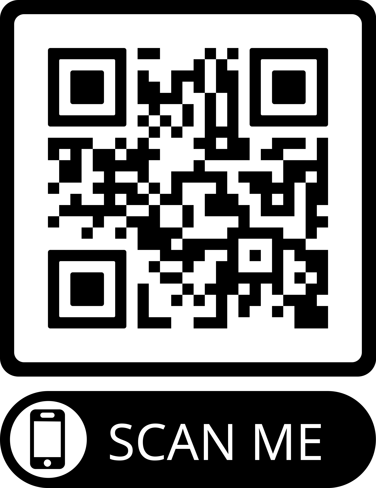

# Aufgaben

## 1. Besorgen sie sich im Internet eine vollständige ASCII-Tabelle als Bild- oder PDF-Datei und ergänzen sie damit ihr ePortfolio.

### ASCII-Tabelle als Bild:

**Bildquelle:** https://www.asciicharstable.com/_site_media/ascii/ascii-chars-table-landscape.jpg

## 2. Suchen sie im Internet nach einer Webseite, wo Unicode-Zeichen gelistet sind und merken bzw. notieren sie sich den Link.

### Link mit aufgelisteten UNICODE-Zeichen:

[Unicode-Zeichen aufgelistet](https://www.compart.com/de/unicode/category/So)

## 3. Sie erhalten eine ZIP-Datei Textsamples.zip unter folgendem Link:
https://juergarnold.ch/Codesysteme/Textsamples.zip
Laden sie die ZIP-Datei auf ihren Notebook und extrahieren sie die drei Dateien
Textsample1, Textsample2 und Textsample3. Eine der drei Dateien ist in
ASCII codiert, die andere in UTF-8 und die dritte in UTF-16. Beantworten sie nun die
folgenden Fragen:

### a. Welche der Dateien ist nun ASCII-codiert, welche UTF-8 und welche UTF-16 BE-BOM?

#### Lösung:

- ASCII-codiert: Textsample2
- UTF-8-codiert: Textsample1
- UTF-16-codiert: Textsample3

### b. Alle drei Dateien enthalten denselben Text. Aus wie vielen Zeichen besteht dieser?

#### Antwort: 

aus 68 Zeichen

### c. Was sind die jeweiligen Dateigrössen? (Beachten sie, dass unter Grösse auf Datenträger jeweils 0 Bytes angegeben wird. Dies darum, weil beim WindowsDateisystem NTFS kleine Dateien direkt in die MFT (Master File Table) geschrieben werden.) Wie erklären sie sich die Unterschiede?

#### Antwort:

UTF-8-kodierte Dateien können grössere Dateigrössen beanspruchen, da sie mehr als nur ein Byte pro Zeichen, im Vergleich zu ASCII-kodierten Zeichen, benötigen können.

### d. Bei den weiteren Fragen interessieren uns nur noch die ASCII- und die UTF8-Datei: Bekanntlich ist UTF-8 in den ersten 128 Zeichen deckungsgleich mit ASCII. Untersuchen sie nun die beiden HEX-Dumps und geben sie an, welche Zeichen unterschiedlich codiert sind. Ein kleiner Tipp: Es sind deren zwei.

#### Antwort:

Diese Unterschiede treten erst auf, wenn ein ASCII-Zeichen außerhalb des Bereichs von 0 bis 127 liegt, da in UTF-8 mit mehr als einem Byte codiert wird. 

Beispiele für Zeichen, welche aus dem Bereich von 0 bis 127 sind:

 1. Euro-Zeichen (€) der europäischen Währung, ist kein ASCII-Zeichen
 2. Yen-Zeichen (¥) der japanischen Währung, ist ebenfalls kein ASCII-Zeichen

### e. Was bedeuten die beiden Ausdrücke, denen wir z.B. bei UTF-16 begegnen: Big-Endian (BE), Little-Endian (LE)?

#### Antwort:

BE und LE legen fest wie die Bytes eines Datums, anhand der Wichtigkeit geordnet werden.

 - Big-Endian (BE) - zuerst wichtigste Bytes eines Datums, dann weniger wichtige (BE wäre yyyy.mm.dd)
 - Little-Endian (LE) - zuerst wenigste wichtige Bytes eines Datums, dann wichtigere (LE wäre dd.mm.yyyy)

### f. Im Notepad++ kann man unter dem Menüpunkt Codierung von ASCII zu UTF umschalten. Spielen sie damit etwas herum und notieren sie sich, was in der Darstellung jeweils ändert.

#### Antwort:

Da Zeichen wie 'ä', 'ö', 'ü' nicht im ASCII enthalten sind, kommen komische "Zeichen", wenn man mehrmals zwischen ASCII und UTF-8 wechselt.

Beispiel:

- **Anfangstext:** "Søren hat übermäßig große Ambitionen, überprüfen Sie bitte die Fähigkeit, französische Sätze korrekt auszusprechen."
  - In diesem Satz enthalten sind:
    - "ø" (dänisches Zeichen)
    - "ß" (scharfes S, deutsches Zeichen)
    - "ü" (Umlaut, deutsches Zeichen)
    - "ç" (Cedille, türkisches und französisches Zeichen)
    - "è" (Akzentzeichen, französisches Zeichen)
    - "â" (Zirkumflex, französisches Zeichen)

- **Text nach dem herumspielen:** "Søren hat überm?g gro? Ambitionen, überprüfen Sie bitte die F?gkeit, französische S?e korrekt auszusprechen."
  - diese Zeichen gibt es in ASCII nicht und wurden nach mehrmaligen Ändern der Kodierung zu Zeichen wie 'ö' geändert.

## 4. Einfacher QR-Code erstellen und lesen: Denken sie sich eine kurze Botschaft, URL etc. aus und bilden sie diese Information in einem QR-Code ab. Danach tauschen sie mit ihrem Banknachbar/in ihre QRCodes aus. Wenn der QR-Code gelesen werden kann, waren sie erfolgreich. Applikationen die alphanumerischen Text in einen QR-Code und zurück wandeln, findet man im Internet.

### Lösung: 

Heute war mein Banknachbar nicht da, darum habe ich es alleine gemacht.

Hier ist der QR-Code als Bild:

## 5. Zusammengesetzte Daten in einem QR-Code:

### Aufgabe: 

Ihre Firma wird mit dem Design von Tickets für ein Fussballstadion beauftragt. Das
Eintrittsticket soll mit einem QR-Code versehen sein, der alle wichtigen Informationen
zur Buchung enthält. Dies soll ermöglichen, das Ticket jederzeit und überall von
Offline-QR-Readern lesen und überprüfen zu lassen bzw. Zugang zu den
Stadionbereichen zu gewähren. Das Ticket soll die folgenden, codierten
Informationen enthalten:

- Datum und Uhrzeit der Veranstaltung
- Fortlaufende, alphanumerische Ticketnummer (Ticketnummern seit Tag-0)
- Numerische Sitzplatznummer (Jeder Sitzplatz hat eigene Nummer)
- Tribünensektor A-Z (Für einfache Platzeinweisung der Besucher)
- ID- oder Passnummer des Besuchers (Tickets nicht übertragbar)

Überlegungen: 

- Überlegen sie sich, ob das Ticket fälschungssicher ist. Braucht es allenfalls noch eine Prüfziffer, Checksum etc.?
- Wenn der Besucher am Stadioneingang erscheint, zeigt er sein Ticket. Dieses wird von einem Platzanweiser mit einem QR-Code-Leser gelesen. Damit kann er die Personalie und Gültigkeit des Tickets überprüfen und den Besucher anschliessend in den richtigen Stadionsektor leiten.
- Bilden sie diesen Datensatz in einen QR-Code ab. Erstellen sie QR-Codes für fiktive Veranstaltungen. Testen sie ihre QR-Codes mit ihrem Banknachbarn/in gegenseitig aus.
- Applikationen die alphanumerischen Text in einen QR-Code und zurück wandeln, findet man im Internet.
- Auf Komplettlösungen aus dem Internet - es gibt zu diesem Thema mehr oder weniger "pfannenfertige" Applikationen - bitte aber verzichten.